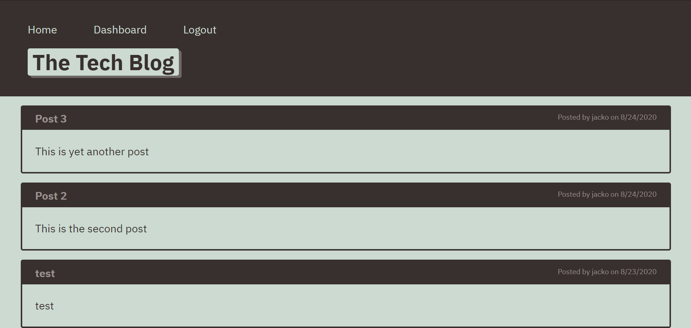

# The Tech Blog

## Description
CMS-style blog site where developers can publish their tech-related blog posts and comment on other developers' posts as well

## Table of Contents
  * [Installation](#installation)
  * [Usage](#usage)
  * [License](#license)
  * [Contributing](#contributing)
  * [Testing](#testing)
  * [Questions](#questions)
  
## Installation
Clone project to a directory on your local machine and cd into the readme-generator directory.  Run <$ npm install> to install project dependencies

## Usage
Create a <.env> file in the project's root and add environmental variables in the form 

    DB_NAME='<your_database_name>' 
    DB_USER='<your_user_name>' 
    DB_PW='<your_mysql_password>' 
    SESS_SECRET='<your_session_secret>'

Open a MySQL shell by entering <$ mysql -u root -p> and then enter your password when requested.  
Run the command <mysql source db/schema.sql> to create the database.  
Run the command <mysql show databases;> to verify the <ecommerce_db> database has been added.  
Run the command (mysql quit;> to return to the command line. 
Run <$ npm start> to start server on http://localhost:3001

## License 
This project is covered under the MIT license 

## Contributing
To see the guidelines adopted for contributing to this project, please view the [Contributor Covenant](https://www.contributor-covenant.org/version/2/0/code_of_conduct/code_of_conduct.txt)

## Testing
Tests coming soon

## Questions
Visit me at GitHub  
[christopherConcannon](https://github.com/christopherConcannon)
  
If you have any questions or would like to contact me, please email me at  
[cmcon@yahoo.com](mailto:cmcon@yahoo.com)
